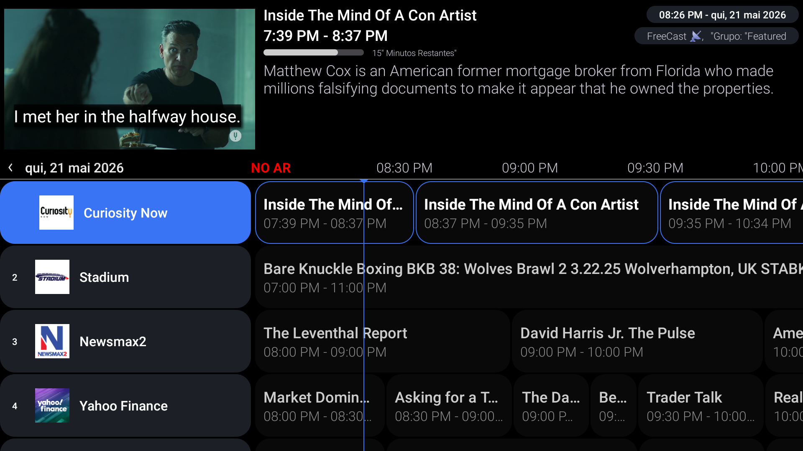

# 🛰️ FreeCast IPTV Automation Suite (M3U + XMLTV)

Este repositório contém uma solução automatizada em Python para mapear, categorizar e extrair canais de TV ao vivo da plataforma FreeCast. O projeto gera de forma independente e integrada dois arquivos essenciais para players de IPTV modernos: a **Lista de Canais (.m3u)** e a **Grade de Programação (.xml)**.

Toda a infraestrutura é atualizada de forma 100% autônoma utilizando o **GitHub Actions**.

---



## 📦 Arquivos Gerados e Links Úteis

Após a execução das automações, o GitHub gera os links diretos (*Raw*) abaixo. Você pode copiá-los e colá-los diretamente no seu player de IPTV (como Tivimate, OTT Navigator, Smart IPTV, Plex ou Jellyfin):

* **📺 Lista M3U (Canais com Categorias):**
    ```text
    https://raw.githubusercontent.com/JulioCesarXY/EPG-FreeCast/refs/heads/main/freecast_canais.m3u
    ```
* **📅 Guia EPG (Padrão XMLTV):**
    ```text
    https://raw.githubusercontent.com/JulioCesarXY/EPG-FreeCast/refs/heads/main/freecast_epg.xml
    ```

*(Nota: Substitua `SEU_USUARIO` e `SEU_REPOSITORIO` pelos dados reais do seu perfil e repositório do GitHub).*

---

## ✨ Recursos Principais

* **Agrupamento por Categorias:** Os canais são divididos automaticamente em grupos originais da plataforma (ex: *Movies, News, Comedy, True Crime*) usando a tag `group-title=""` no arquivo M3U. Os players criam abas automáticas com base nisso.
* **Vínculo Automático (Match):** Tanto o script do M3U quanto o do EPG utilizam os mesmos identificadores únicos da API para os canais (`tvg-id`). Isso garante que o player sincronize o canal com o seu respectivo horário de programação sem qualquer configuração manual.
* **Requisições em Lote (Lotes de 10):** O script de EPG divide as consultas de 10 em 10 slugs para evitar URLs excessivamente longas, protegendo a automação contra bloqueios de segurança do servidor.

---

## ⚙️ Estrutura do Repositório e Automações

O repositório está organizado da seguinte forma:

```text
├── .github/
│   └── workflows/
│       ├── atualizar_epg.yml   # Agendamento diário do guia XMLTV
│       └── atualizar_m3u.yml   # Agendamento diário das URLs de vídeo
├── ExtrairGerar.py             # Script principal do EPG / XMLTV
├── extrair_streams.py          # Script principal dos Canais / M3U
├── freecast_epg.xml            # Guia de programação XMLTV final
└── freecast_canais.m3u         # Lista de reprodução IPTV final
